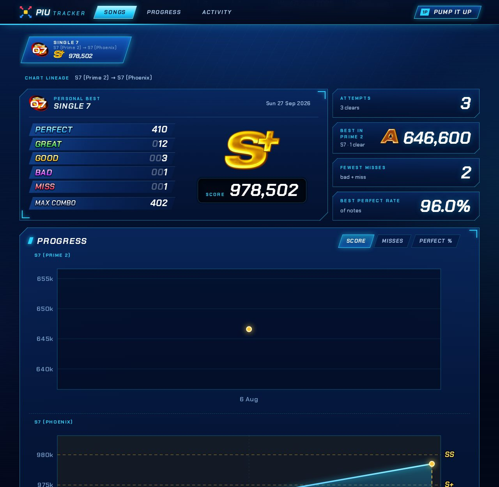

# Game versions

Each play belongs to a version of Pump It Up, named by its `version` key. A play without one is from Phoenix, so data files from before versions existed mean what they always did, and `schema_version` is still 1.

```yaml
  - song: Le Grand Bleu
    chart: S7
    version: prime2
    date: "2025-09-09 18:15"
    score: 1038500
    grade: S
    judgments: {perfect: 496, great: 31, good: 2, bad: 1, miss: 0}
    max_combo: 460
    kcal: 19.18
```

| `version` | Version | Grades | Checked |
| --- | --- | --- | --- |
| `phoenix` (default) | Pump It Up Phoenix | SSS+ to F | Everything in [Typo checks](logging-scores.md#typo-checks) |
| `phoenix2` | Pump It Up Phoenix 2 | SSS+ to F | The same as Phoenix, with Phoenix 2's grades, as below |
| `prime2` | Pump It Up Prime 2 | SS, S, A, B, C, D, F | A `score` is given, as a multiple of 100; a `grade` is one of the version's; no `plate` |
| `xx` | Pump It Up XX (20th Anniversary Edition) | SSS, SS, S, A, B, C, D, F | The same as Prime 2 |

The version can also be written with capitals or spaces (`Phoenix 2`, `Prime 2`). Any other value is rejected, and the problem lists the supported ones.

**The cabinet is the record.** A play's score and grade are kept and shown exactly as the result screen showed them, in its own version's scale: nothing is converted into another version's. Scores of different versions only look alike. A Prime 2 score can be over 1,000,000 (Le Grand Bleu S7's 1,038,500 above), and Prime 2's grades are not Phoenix's.

**Phoenix 2** scores plays exactly as Phoenix does, and has the same grades and plates. It raised every grade cutoff below AAA, so the same score can earn a lower grade:

| Grade | A | A+ | AA | AA+ | AAA and up |
| --- | --- | --- | --- | --- | --- |
| Phoenix | 750,000 | 825,000 | 900,000 | 925,000 | the same in both |
| Phoenix 2 | 800,000 | 900,000 | 920,000 | 940,000 | |

A Phoenix 2 play is checked as a Phoenix play is, and its grade is worked out from its score with these cutoffs. They are [PIU Scores](https://piuscores.arroweclip.se)' reading of the official leaderboards. Nothing there shows where B, C and D start, so a score under 800,000 is graded as logged: `grade` is optional, and a play without one shows no grade.

**Prime 2 and XX** plays take `score`, `grade`, `judgments`, `max_combo`, `kcal`, `note` and `broken` just as Phoenix plays do, with these differences:

- `score` is required: it cannot be worked out from the judgments (see below). There is no upper limit. Both versions round scores down to a multiple of 100, so any other score is rejected as a typo; otherwise the score is taken as logged.
- `plate` is rejected, since neither version has plates.
- `grade` is optional and shown as logged, as long as the version has it: `SSS` is not a Prime 2 grade (XX renamed Prime 2's SS, gold S and silver S to SSS, SS and S). A play without one shows no grade. Log a gold or silver Prime 2 S as `S`.
- A cracked grade on an XX result screen means the life bar ran out: log it with `broken: true`, like any stage break with a score.

Scores and grades are not checked beyond that, since neither can be worked out from a result screen:

- **Score.** Pump It Up scored plays the same way from Zero to XX ([NamuWiki](https://namu.wiki/w/%ED%8E%8C%ED%94%84%20%EC%9E%87%20%EC%97%85/%EA%B8%B0%EB%B3%B8%20%EC%8B%9C%EC%8A%A4%ED%85%9C)). Each judgment scores points: Perfect 1,000, Great 500, Good 100, Bad −200, and Miss −500, or −300 on a hold. Each Perfect or Great from the 51st combo on adds 1,000 more, and an S or better adds a grade bonus (100,000 for a silver S). Above level 10, scores are also multiplied by the level ÷ 10, and doubles by 1.2. The total is rounded down to a multiple of 100. This agrees with all 15 Prime 2 result screens it was tested on, 5 of them exactly. The exact score, though, depends on where the combo broke and on which misses were on holds, and the result screen shows neither.
- **Grade.** The documented rule gives an S for no Miss and at least 95% of a weighted accuracy, then A, B, C and D at 90, 85, 80 and 75%. It gives an A for a real Prime 2 B (Yog-Sothoth S9, 61 misses) and a B for a real XX C. The accuracy also depends on the number of hold judgments, which the result screen does not show.

Prime 2 and XX score plays the same way but name grades differently, so each has a scoring system of its own. Phoenix and Phoenix 2 grade the same score differently, so each has one too.

**Charts** of different versions are different charts, even when the song and level are the same: levels get re-rated between versions, and steps sometimes change. A Prime 2 S7 and a Phoenix S7 of the same song are listed separately, each with its own personal best and history, unless they are linked (see [Chart continuity](#chart-continuity)). Phoenix and Phoenix 2 charts that are the same steps are linked by themselves.

**Personal bests** are only ever compared between versions whose scores compare: plays of the same chart, in versions that score plays the same way. Phoenix and Phoenix 2 do, even though they grade differently. Prime 2 and XX score the same way too, but their scores also depend on the chart's level, which is often re-rated between them, so each keeps its own. A version's first play of a chart is its first clear there, unless a linked chart's scores compare with it.

**The headline stats** on the home page cover the newest version you have played: plays, songs, charts, hardest clears, PUMBILITY, fails, new bests and the grade breakdown. Under them, a line counts your plays per version. When you log your first play from a newer version, the headline stats move to it by themselves.

**On the pages:**

- **Songs list:** each song shows the newest version it was played in: its level balls and best grade. A song whose newest version is older than the newest one you played has a version badge. The version filter above the list (default: all versions) lists only the songs played in one version, and shows each in that version.
- **Song page:** the charts are grouped by version under a header naming it, newest version first. There are no headers when every chart is from the newest version you played.
- **Attempts and activity:** plays from a version older than the newest one you played have a version badge, and each play's grade is from its own version. The activity page has the same version filter.
- **Jacket art** is looked up by song title, so every version of a song shares it.

## Chart continuity

When the same step chart is in two versions, possibly at a different level, link them in the song's metadata with a lineage: a mapping from each version to the chart as that version labels it.

Charts of Phoenix and Phoenix 2 need no lineage: the chart list built into the app (see [Progress](progress.md#the-chart-list)) knows which charts are the same steps, even when one was re-rated, and links them by itself. That includes a Phoenix chart at the end of a lineage from an older version: its Phoenix 2 chart joins the lineage. A lineage that names a Phoenix 2 chart takes precedence over the list.

```yaml
piu_tracker_songs:
  Katkoi:
    lineages:
      - {prime2: S7, phoenix: S8}   # Prime 2's S7 is the same steps as Phoenix's S8
      - {prime2: D17, phoenix: D18}
```

A lineage is declared once for all the plays of its charts, before or after, and can span any number of versions, in any order: they are put in release order. A song can have several. A lineage is rejected when:

- it names fewer than two versions, or the same version twice (`prime2` and `Prime 2`);
- a version or chart is not recognised;
- one of its charts has no plays, for example because of a typo in the version or chart, or because it is another song's: a lineage stays within one song;
- one of its charts is already in another of the song's lineages.

The song page shows a lineage as one chart, listed under its newest version and labelled with each version's level, such as "S9 (Phoenix) → S10 (Phoenix 2)":

- **Attempts** span the whole lineage. Each play names its chart, and has a version badge when it is from a version older than the newest one you played.
- **Personal bests, first clear and best plate** carry across a link only when both versions' scores compare. A Phoenix chart linked to Phoenix 2 continues its history: the first Phoenix 2 play is compared with the best from Phoenix. The linked charts then share one history, in date order, so a best set in the newer version also counts for the older chart if you play it there again. Each play keeps its own version's grade, and the chart is shown with the newest version's grade lines. Across a link between versions whose scores don't compare, such as Prime 2 → Phoenix, each version keeps its own. The page shows the newest version's personal best, with the older versions' bests beside it.
- **Progress charts:** misses and perfect % compare in every version, so they span the whole lineage, with a dashed line where it moves to another chart. The score chart spans the lineage only while the scores compare. Across versions whose scores don't, it is drawn in separate parts, each headed with its versions, and never as one line.
- **PUMBILITY** only ever counts a version's own plays, as the game does, even across a link.


