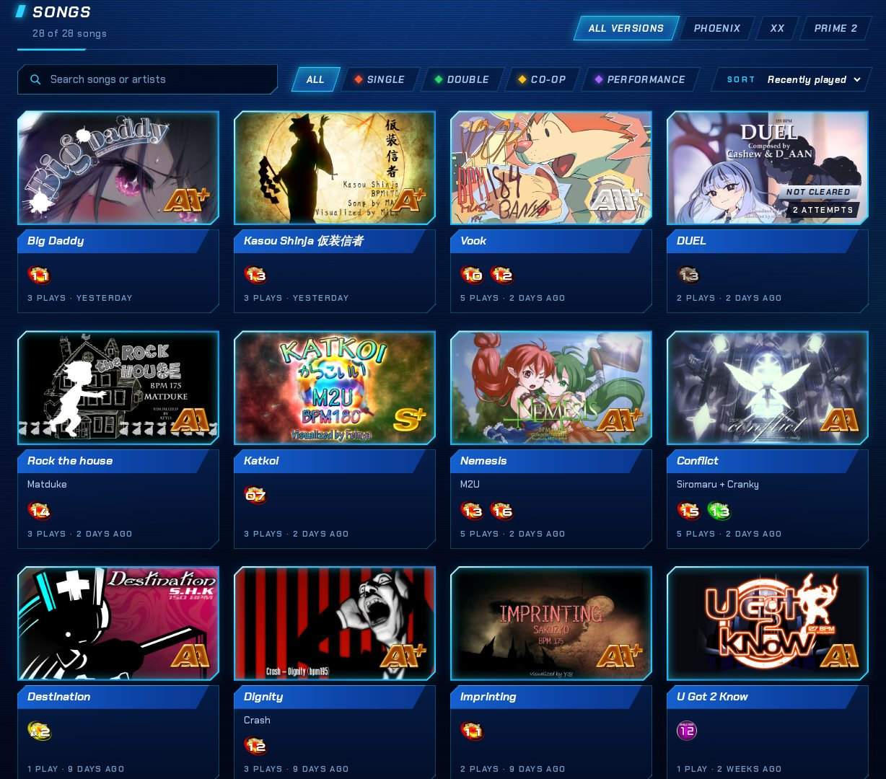
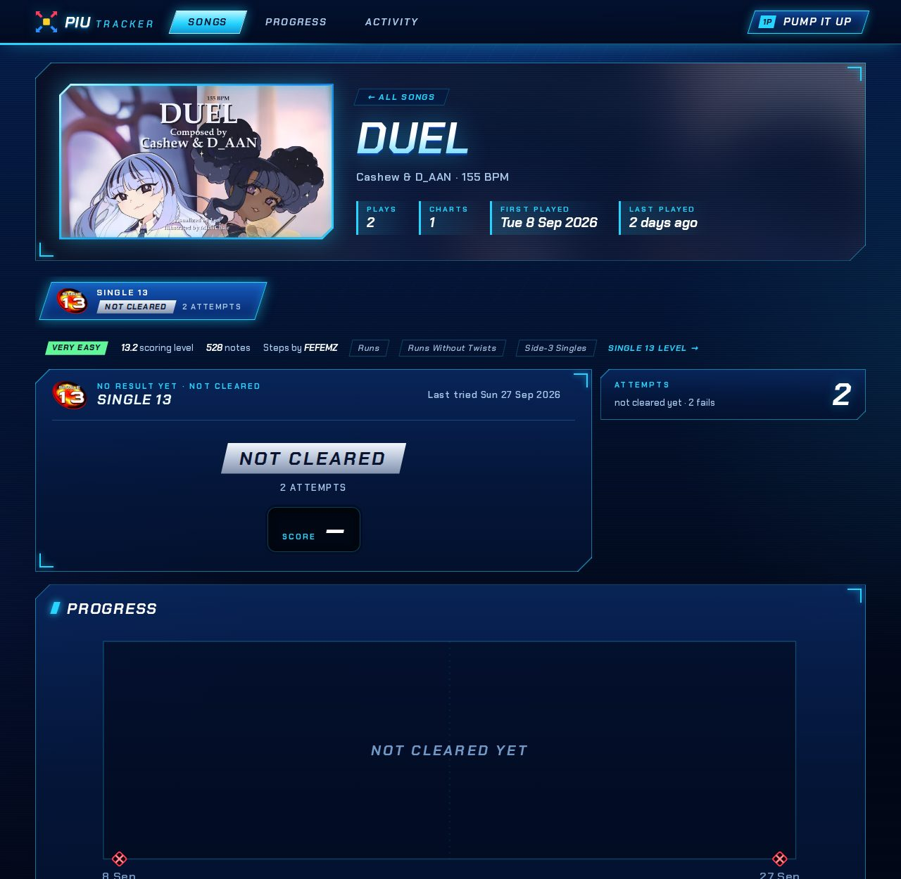

# Logging scores

You log each result screen as an entry in `piu_tracker_scores` in your Ansible variables. The [`ansible-role-piu-tracker`](https://github.com/spatterIight/ansible-role-piu-tracker) role renders them into the data file this app reads.

This is what one play looks like in the Ansible variables, taken from a real result screen:

```yaml
piu_tracker_scores:
  - song: Big Daddy
    chart: S11                 # the level ball: S11, D21, SP12, DP20, CoOp2
    date: 2026-09-28           # or "2026-09-28 18:45" to order plays within a day
    score: 938204
    plate: TG                  # PG UG EG SG MG TG FG RG, or the full name ("Talented Game")
    judgments: {perfect: 506, great: 31, good: 11, bad: 7, miss: 6}
    max_combo: 294
    kcal: 31.137
    note: "finally"            # optional
```

Only `song`, `chart` and `date` are always required. Everything else is optional, as long as there is either a `score` or both `judgments` and `max_combo` to work it out from. Add `broken: true` for a stage break. A play from another version of the game than Phoenix names it with `version` (see [Game versions](game-versions.md)).

## Failed plays

When you fail a chart and the result screen shows `-` instead of a score, log the play with `broken: true` and no result:

```yaml
  - {song: DUEL, chart: S13, date: "2026-09-08", broken: true}
```

Such a play may only have `song`, `chart`, `date`, `kcal` and `note` (and `version`). This works the same way in every version. It has no score or grade, and never counts as a clear or a personal best. It shows as "Failed" in the attempts table and the activity list, and as a marker along the bottom of the progress chart. A song or chart with no clear yet shows "Not cleared" with its number of attempts instead of a grade.

A stage break that still shows a score is logged with `broken: true` and its score (or judgments and max combo).

| Songs not cleared yet | A chart not cleared yet |
| --- | --- |
|  |  |

## Typo checks

Every entry is checked before it is shown. A deploy with a mistake in it fails and names the entry:

- **Score against judgments.** When the judgments and max combo are both given, the score must match what the game would award for them:

  `1,000,000 × (0.995 × (Perfect + 0.6·Great + 0.2·Good + 0.1·Bad) + 0.005 × MaxCombo) / Notes`
- **Grade against score.** A `grade`, if given, must match the Phoenix grade table. Grades are worked out from the score otherwise.
- **Failed plays.** A `broken: true` play with no score cannot have a `grade`, `plate`, `judgments` or `max_combo`. Without `broken: true`, a play with no score is rejected.
- **Everything else:** chart notation, dates, plate names, and unknown keys (such as `perfects:`) are rejected with an explanation.

These are Phoenix's checks. Plays from other versions are checked by their own version's rules, and a problem with such a rule names the version ("plate is not used in Prime 2"); see [Game versions](game-versions.md).

> [!IMPORTANT]
> The cabinet pads numbers with zeros (`031`), and YAML reads numbers with a leading zero as octal, so `great: 031` arrives as 25. Write `great: 31`. The score check catches this when judgments are given.

## Data file

The role writes the variables to a JSON file that this app reads (`schema_version: 1`):

```json
{
  "schema_version": 1,
  "player": { "name": "PUMP IT UP" },
  "songs": { "Conflict": { "artist": "Siromaru + Cranky", "bpm": "160", "image": "" } },
  "scores": [
    { "song": "Big Daddy", "chart": "S11", "date": "2026-09-28", "score": 938204 },
    { "song": "DUEL", "chart": "S13", "date": "2026-09-08", "broken": true },
    { "song": "Vook", "chart": "S7", "date": "2025-07-25 22:03", "version": "prime2", "score": 419400, "grade": "A" }
  ]
}
```

`songs` is optional metadata keyed by title. It holds `artist`, `bpm`, `image`, which is either an image URL or a file name in the custom art directory (see [Jacket art](configuration.md#jacket-art)), and `lineages` (see [Chart continuity](game-versions.md#chart-continuity)). Titles are matched case-insensitively. See [`sample/tracker.json`](../sample/tracker.json) for a complete example.
