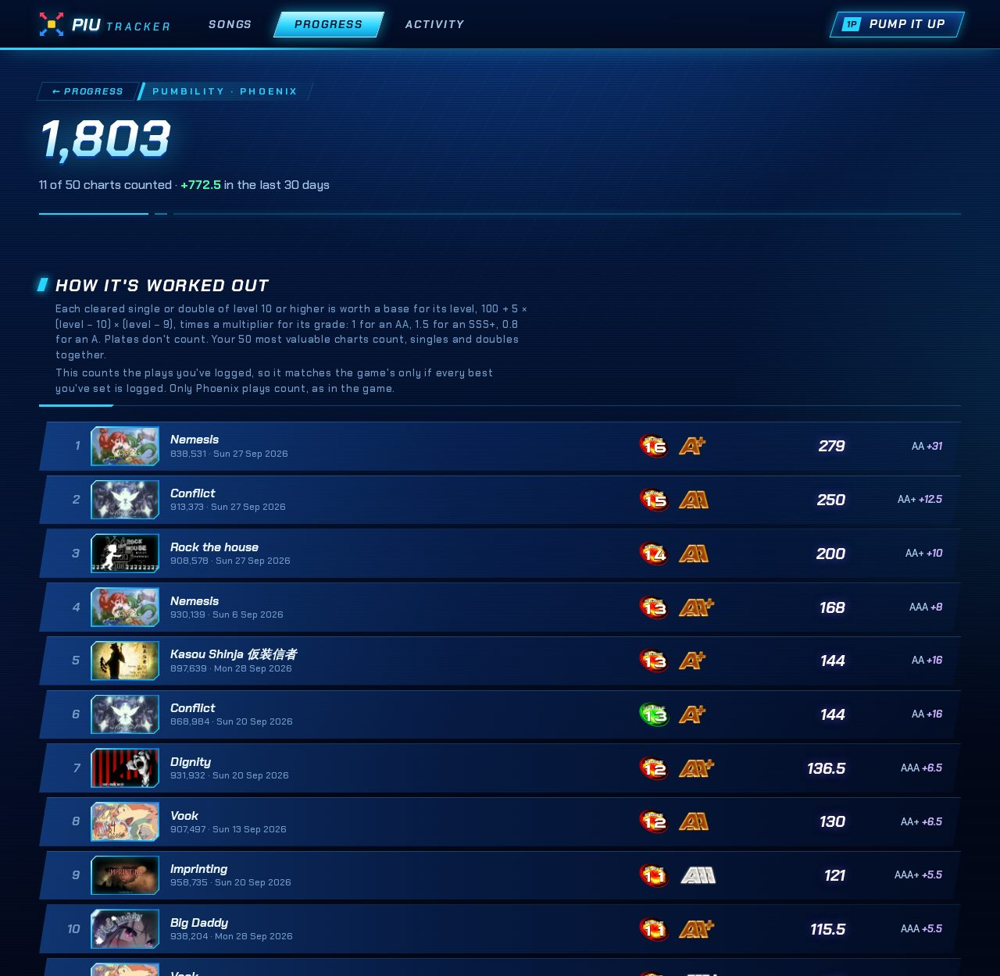

# Progress

The Progress page measures your plays in the game's own terms. It shows your PUMBILITY, the charts to clear next, and how much of each level you've cleared. It covers Phoenix and Phoenix 2: the newest of them you've played, with a switch to the other when you've played both. Plays from Prime 2 and XX have no PUMBILITY and aren't in the chart list, so the page leaves them out.

## PUMBILITY

PUMBILITY is the game's rating of a player. It is the sum of the values of your 50 most valuable charts, singles and doubles together.

- **A chart's value** is a base for its level, times a multiplier for the grade of your best clear. A harder level is worth a lot more: a plain A on an S17 beats an SSS+ on an S13.
- **Only clears of singles and doubles of level 10 or higher count.** Stage breaks, co-op, performance charts and anything below level 10 are worth nothing.

The Progress page shows your PUMBILITY and how much it grew in the last 30 days. Under that is its history: the total at the end of each day you played. The home page shows it too, as one of the headline stats.

Until you have 50 charts, every clear of level 10 or higher adds its full value. After that, a new clear only counts if it is worth more than the least valuable of your 50. The page calls that value the cut, and a new clear adds only what it is worth above the cut.

The PUMBILITY page lists your charts, most valuable first. Each chart shows its value and what the next grade up would add. Charts outside your 50 are listed below them, dimmed.

**Phoenix:**

- A chart of level 10 or higher has a base of 100 + 5 × (level − 10) × (level − 9): 100 at 10, 250 at 15 and 650 at 20.
- The base is multiplied by the grade's multiplier: 1 for AA, 0.8 for A, 1.2 for S and 1.5 for SSS+.
- Plates don't count.

**Phoenix 2:**

- A double of level 10 or higher has a base of 130 + 5 × level, plus 5 more for each level over 24. A single is priced as a double one level higher.
- The base is multiplied by the sum of the grade's multiplier and a plate bonus:
  - The multiplier is 1.37 for a double's AA (1.36 for a single's) and 1.50 for SSS+.
  - The plate bonus goes from nothing for a Rough Game up to 0.02 for a Perfect Game.
- Phoenix 2 doesn't publish this formula. [PIU Scores](https://piuscores.arroweclip.se) worked it out from the official breakdowns of players' PUMBILITY; the values for levels 28 and 29, which no one's breakdown has included yet, are the formula's extrapolation.
- A Phoenix 2 score under 800,000 logged without a grade is valued as B from 700,000, C from 600,000 and D from 500,000, as PIU Scores takes them. See [Game versions](game-versions.md). The PUMBILITY page marks such a grade "est.".

A few rules hold in both versions:

- **A chart is valued by its highest-scoring clear.** In Phoenix 2 it takes that clear's plate; a play with no plate logged gets no plate bonus.
- **Only plays of the version count, as in the game.** A Phoenix best linked to a Phoenix 2 chart counts for Phoenix's PUMBILITY, not for Phoenix 2's.
- **It counts the plays you've logged.** It matches the game's number only if every best you've set is in your log.

## Level folders

The game's song select lists the charts of each level together. The page shows every single and double level of the version as a folder, with the number of its charts you've cleared. A folder turns gold once you've cleared all of it.

Each folder has a page of its own, `/progress/s17` for Single 17. It lists every chart of the level, easiest to clear first. A chart you've played links to it on its song's page, and one you haven't shows its jacket if the app has one built in. The chips at the top show all charts, only the ones not cleared, or only the cleared ones. A chart you've logged that isn't in the chart list is listed at the end, as "Not in the list".

**How hard a chart is** comes from PIU Scores, whose players' scores it is worked out from:

- **Pass difficulty** says how many players pass the chart, against the other charts of its level. It runs from "1+ level easier" (easier than a whole level lower), through very easy, easy, medium, hard and very hard, to "1+ level harder".
- **Where too few players have passed a chart to tell,** as with most Phoenix 2 charts so far, the score difficulty is used instead. It is on the same scale and says how well players score on the chart.
- **Charts with the same difficulty** are ordered by their scoring level: the level PIU Scores' players score on them as if it were, such as 17.4 for a hard S17.

**Clear next** on the Progress page picks up to four charts from two folders: your hardest level cleared, and the one above it. They are the easiest charts there you haven't cleared. With each is what a clear at AA would add to your PUMBILITY.

Cleared means the same here as on the song page: a clear of a linked chart in an earlier version with the same scoring carries over (see [Chart continuity](game-versions.md#chart-continuity)).

## The chart list

The chart list comes from PIU Scores and is built into the app as a snapshot, like the jackets. The pages make no outside requests for it. [`internal/catalog/data/SOURCE.txt`](../internal/catalog/data/SOURCE.txt) says when it was taken; [Development](development.md#refreshing-the-chart-list) says how to refresh it. Besides the folders, it is used in three other places:

- **Song pages** show what the list says about each chart: its difficulty for its level, scoring level, note count, step artist and skill tags (Twists, Drills, Brackets…), with a link to its level folder. A song's artist and BPM come from the list when its metadata has none.
- **Charts are linked across versions.** The list knows which Phoenix 2 chart is the same steps as which Phoenix one, even when it was re-rated, so they are linked as a lineage would link them (see [Chart continuity](game-versions.md#chart-continuity)).
- **A note-count check** warns when a play's judgments don't add up to the chart's note count (see [Typo checks](logging-scores.md#typo-checks)).
